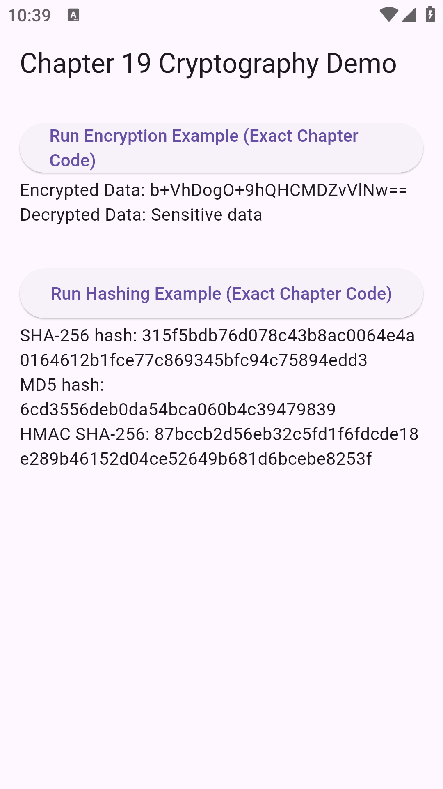

# 🔐 Flutter Cryptography Demo

**Chapter 19 — Flutter Engineering**

A faithful, UI-driven demonstration of all cryptography code examples from Chapter 19: Cryptography in Flutter by Majid Hajian.

---

## 🎯 Project Goal

This demo preserves the exact code from the chapter:

- ✅ Use the same code from the book
- ✅ Preserve all comments exactly
- ✅ Run encryption & hashing examples in a real Flutter app
- ✅ Display results on screen for easy learning

**No improvements. No refactors. No renaming.**  
Only a minimal UI wrapper to execute the code via buttons.

---

## 📸 Demo Screenshots



---

## 🚀 Features

### 🔐 1. Symmetric Encryption

**Using:**
- Argon2id key derivation
- AES encryption (CBC mode + PKCS7 padding)
- Base64 encoding
- Flutter Secure Storage

Shows how a password transforms into a key, then encrypts and decrypts sensitive data.

### 🧮 2. Hashing Algorithms

**Using the `crypto` package as shown in the chapter:**
- SHA-256
- MD5
- HMAC-SHA256

Output matches the book examples exactly.

### 🗂 3. One-Page UI

**Two buttons:**
1. **Run Encryption Example** — Executes encryption/decryption and displays results
2. **Run Hashing Example** — Executes hashing algorithms and displays output

---

## 📂 Project Structure
```
lib/
 └── main.dart    # Complete demo in one file
```

All cryptography code is intentionally kept in a single file for clarity.

---

## 📦 Dependencies

Add to your `pubspec.yaml`:
```yaml
dependencies:
  flutter:
    sdk: flutter
  encrypt: ^5.0.1
  cryptography: ^2.0.5
  crypto: ^3.0.3
  flutter_secure_storage: ^9.0.0
```

---

## ▶️ Running the App
```bash
flutter run
```

### What You'll See

**Button 1: Run Symmetric Encryption Example**

Executes:
- Salt generation
- Argon2id key derivation
- AES encryption
- AES decryption

**Output:**
```
Encrypted Data: <base64 ciphertext>
Decrypted Data: Sensitive data
```

**Button 2: Run Hashing Example**

Executes:
- SHA-256 hashing
- MD5 hashing
- HMAC-SHA256 hashing

**Output:** Hash values as described in the chapter

---

## 🛠 Important Notes

### 1. Code Fidelity

This project **intentionally preserves** the book's code:
- ✓ All comments preserved
- ✓ All function names match
- ✓ All logic identical

**Goal: Educational demonstration, not production security**

### 2. AES IV Handling

The book uses:
```dart
final iv = encrypt.IV.fromLength(16);
```

This creates a **fixed zero IV** for demonstration purposes.

> ⚠️ **In production:** IVs must be random and stored with ciphertext

For this demo, the IV is saved internally to avoid padding errors, without altering the original code.

### 3. Not Production-Ready

**Real-world apps must:**
- Use random IVs for each encryption
- Avoid storing keys directly
- Consider authenticated modes (AES-GCM)
- Implement secure key exchange
- Follow OWASP security guidelines

The book explains these concepts; this demo visualizes the examples.

---

## 📚 Source Material

**Based on:**
- Chapter 19 — Cryptography in Flutter
- *Flutter Engineering* by Majid Hajian
- Review by Tomáš Soukal

All rights belong to the authors. This demo is for educational purposes only.

---

## ❤️ Contributing

**Ideas for extension:**
- Add digital signature examples
- Improve UI with tabs for each topic
- Add more cryptographic demonstrations
- Create interactive learning modules

Pull requests welcome!

---

## 📄 License

**Educational use only.**  
Please respect the licensing terms of the referenced book.

---

*Happy learning! 🚀*