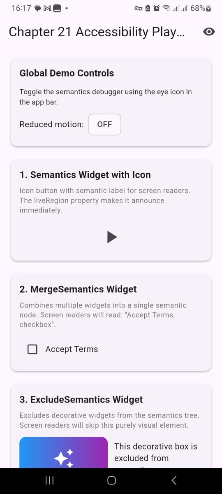
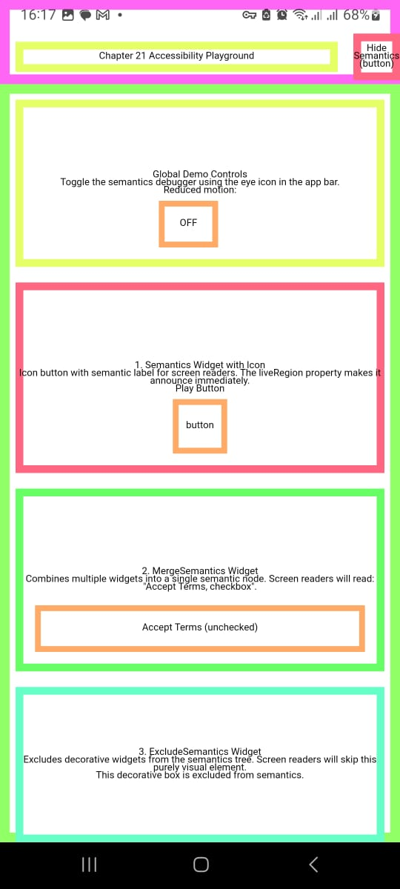

# Chapter 21: Accessibility Demo

A Flutter demo project showcasing accessibility concepts from **Chapter 21** of [Flutter Engineering](https://www.flutterengineering.io/) by Majid Hajian.

## 📖 About

This is a practical demo implementing 20+ accessibility examples from the book, demonstrating how to build inclusive Flutter applications.

## 🏗️ Project Structure

```
lib/
└── main.dart                 # Main demo with all examples

test/
└── accessibility_test.dart   # Accessibility tests
```

## ✨ Code Concepts Demonstrated

### Core Widgets
1. **Semantics** - Label UI elements for screen readers
2. **MergeSemantics** - Combine multiple widgets into one semantic node
3. **ExcludeSemantics** - Hide decorative elements from assistive tech
4. **BlockSemantics** - Block semantics behind modals/dialogs
5. **Tooltip** - Provide contextual information
6. **TextButton** - Semantic button labels

### Text & Readability
7. **Readable Fonts** - Clear font selection (Roboto)
8. **High Contrast Text** - WCAG-compliant contrast ratios
9. **Dynamic Font Sizing** - Adapt to system font settings
10. **Text.rich()** - Styled text with emphasis
11. **Flexible Text** - Proper text wrapping and overflow

### Interactive Elements
12. **Slider** - Accessible value indicators
13. **GestureDetector** - Simple accessible gestures
14. **Semantic Labels for Icons** - Describe non-text elements
15. **Custom Actions & Hints** - Guide screen reader users
16. **Drag & Drop Alternatives** - Button alternatives for motor-impaired users

### Navigation & Scrolling
17. **ListView with Semantic Indexes** - Item positioning for screen readers
18. **CustomScrollView** - Advanced scrollable content with slivers
19. **Focus Traversal Order** - Control reading order with `sortKey`

### System Preferences
20. **Reduced Motion** - Respect system animation settings

## 🚀 Getting Started

```bash
# Install dependencies
flutter pub get

# Run the app
flutter run

# Run tests
flutter test
```

## 🧪 Testing

The project includes examples of:
- `androidTapTargetGuideline` - 48x48 minimum tap target
- `iOSTapTargetGuideline` - 44x44 minimum tap target
- `textContrastGuideline` - WCAG contrast compliance
- `labeledTapTargetGuideline` - All interactive elements labeled
- `matchesSemantics` - Verify semantic properties

## 🎯 Features

- **Semantics Debugger Toggle** - Eye icon in app bar to visualize semantics tree
- **20+ Working Examples** - Each in a separate card with descriptions
- **Screen Reader Support** - Test with TalkBack (Android) or VoiceOver (iOS)
- **Reduced Motion Detection** - Animations adapt to system settings

## 📸 Screenshots

### Main Demo Screen


### Semantics Debugger Active


### Examples in Action


## 📚 Reference

**Book**: Flutter Engineering by Majid Hajian  
**Chapter**: 21 - Ensuring Accessibility for All  
**Reviewwer**: Manuela Rommel